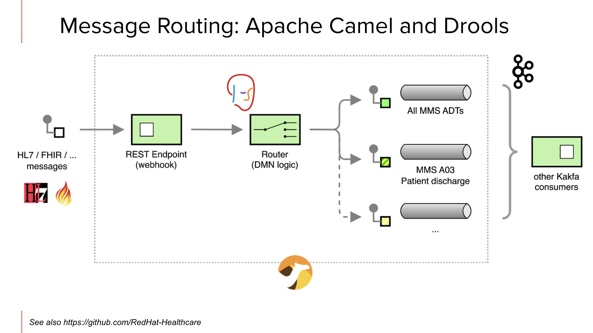
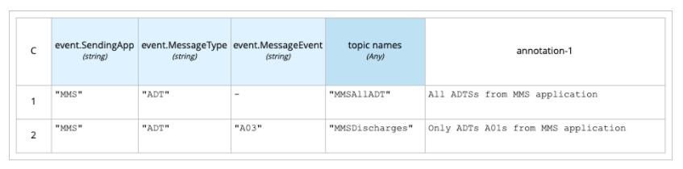

# Demo-iDAAS-DREAM
Demo of iDAAS DREAM capabilities

You can see it in action in this [demo recording](https://www.youtube.com/watch?v=tNe6QU1Yq8U) and some additional technological details in this [blog post](https://blog.kie.org/2021/06/intelligent-kafka-message-routing-using-drools-dmn-engine-and-apache-camel.html).

## Technologies used

- [Apache Camel](https://camel.apache.org) 
- [Drools](https://drools.org)
- [DMN](https://drools.org/learn/dmn.html) standard for defining the business rules logic

# Requirements

- [Maven](https://maven.apache.org/) 3.6.2 or later
- [Java](https://openjdk.java.net/install/) 1.8 or later 
- Docker installation for running integration tests and manual demo

# Building 

Issuing `mvn clean install` will build the solution locally.

Alternatively pre-built artifacts are distribuited through Maven Repositories

# Demo objectives

Showcase the ability to route data real time and create new topics on demand as needed to help facilitate information processing and addressing needs for business in real time.



- HL7 `ADT` messages from `MMS` application routed to `MMSAllADT` kafka topic
- HL7 `ADT` messages from `MMS` application for `A03` "_Patient Discharge_" are also routed to `MMSDischarges` kafka topic
- etc.

Routing rules are implemented with DMN:



# Running the demo (locally)

Integration test during the Maven build phase checks the same Camel route used for intelligent routing of HL7 / iDAAS EventBuilder messages.

The demo can be run locally with the successfully built solution artifacts, following the steps below.

Launch a simple Kafka cluster where the messages will be routed in the different Kafka topics.

```
docker-compose up -d
```

Launch the default iDAAS DREAM demo

```
cd idaas-dream-demo && mvn exec:java
```

Sending an HL7 message for `A03` will show being routed to the `MMSAllADT` and `MMSDischarges` Kafka topics

```sh
curl --location --request POST 'localhost:8080/hl7/new' \
--header 'Content-Type: text/plain' \
--data-raw 'MSH|^~\&|MMS|DH|LABADT|DH|201301011226||ADT^A03|HL7MSG00001|P|2.3|
EVN|A01|201301011223||
PID|||MRN12345^5^M11||APPLESEED^JOHN^A^III||19710101|M||C|1 DATICA STREET^^MADISON^WI^53005-1020|GL|(414)379-1212|(414)271-3434||S||MRN12345001^2^M10|123456789|987654^NC|
NK1|1|APPLESEED^BARBARA^J|WIFE||||||NK^NEXT OF KIN
PV1|1|I|2000^2012^01||||004777^GOOD^SIDNEY^J.|||SUR||||ADM|A0|'
```

Sending an HL7 message for `A02` will show being routed to the `MMSAllADT` Kafka topic only

```sh
curl --location --request POST 'localhost:8080/hl7/new' \
--header 'Content-Type: text/plain' \
--data-raw 'MSH|^~\&|MMS|1|||20050110114442||ADT^A02|59910287|P|2.3|||
EVN|A02|20050110114442|||||
PID|1||10006579^^^1^MRN^1||DUCK^DONALD^D||19241010|M||1|111^DUCK ST^^FOWL^CA^999990000^^M|1|8885551212|8885551212|1|2||40007716^^^AccMgr^VN^1|123121234|||||||||||NO
PV1|1|I|IN1^214^1^1^^^S|3||PREOP^101^|37^DISNEY^WALT^^^^^^AccMgr^^^^CI|||01||||1|||37^DISNEY^WALT^^^^^^AccMgr^^^^CI|2|40007716^^^AccMgr^VN|4|||||||||||||||||||1||I|||20050110045253||||||'
```

Stop the demo by quitting the java application and stop the simple Kafka cluster from the root of this project using

```
docker-compose down
```
