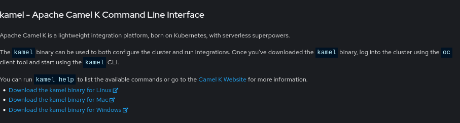

# Introduction to camel-k

https://developers.redhat.com/topics/camel-k

*Camel-k* or kamel is a developer framework for Camel integrations that works well with OpenShift and other Kubernetes platforms. 

* Real-time Coding
* Native on Cloud
* Dependency Management
* Simple, lightweight and Powerful
* Serverless - the easy way
* Supersonic, Subatomic runtime [Quarkus](https://developers.redhat.com/products/quarkus/overview)

Using Yaml, Java or Groovy describe your route, and *kamel* does the rest for you. 

## Installation

https://camel.apache.org/camel-k/1.10.x/installation/installation.html

### Openshift

Two options:

1. Install a cluster level operator from the Operator Hub
2. Use kamel cli to install cluster level or local operator, kamelets etc

Downloading the CLI:
In the Openshift console, click on the ? (help) in the top right corner, and on the drop-down select "Commandline tools".  Find the Kamel section:

.

Select your platform, and click the download link. You'll get a tar-ball (tgz/tar.gz) file, which you need to extract on your local workstation. On Linux write: `tar xvf camel-k-client-1.*.tar.gz` or what-ever filename you received. Move the extracted `kamel` executable to your local bin:

```
$ mv kamel ~/bin/
```
The file is already executable. To test write: `kamel version`

```
$ kamel version
Camel K Client Red Hat 1.8.0
```

All you have to do now is setup a namespace/project in OpenShift with kamel:

```
oc new-project cerner-example
kamel install
```

You can use an existing namespace by using the -n parameter or by making it default. If you have cluster admin rights, you can add --global and the operator will be added, making the kamel CSV extensions availble. This also installs all available kamelets by default. 

TODO: Add Kamelet sink example